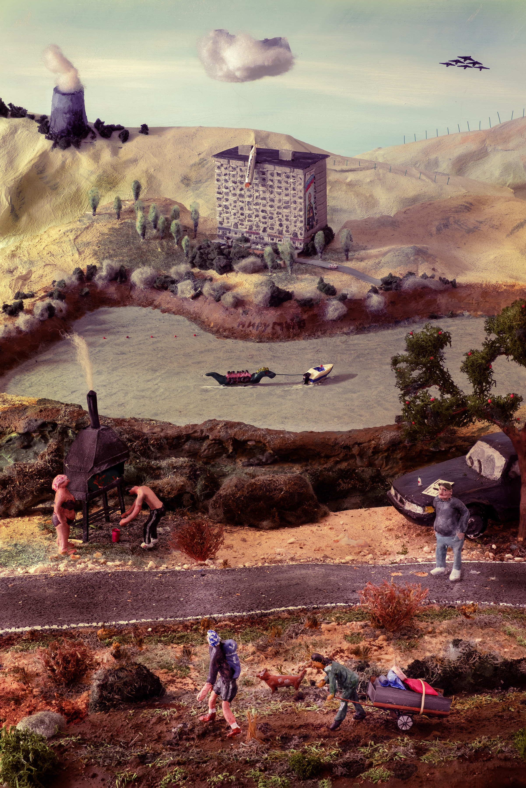



In 2025 maakte ik een diorama over de oorlog in Oekraïne.

Ik bouwde zeven maanden lang aan mijn diorama Miroe Mir. Daarna maakte ik er een foto van. Ik gebruikte hiervoor de natuurlijke lichtinval door het zolderraam. 

Een diorama maken en fotograferen: een project waar ik al enkele jaren mee rondliep, maar waar tijd voor nodig was. Elke avond trok ik me plichtsbewust terug in mijn zolderkamertje om te knutselen. Aanvankelijk worstelde ik vooral met technische uitdagingen (materialen, standpunt, perspectief), maar gaandeweg kreeg ook het onderwerp vorm, beïnvloed door mijn emotionele band met het Oostblok en de oorlogsbeelden die zich al drie jaar lang aan me opdringen. 

Het werk heet Miroe Mir, naar een populaire Sovjetleuze, Vrede voor de wereld. Ik koos voor het diorama vanwege het afgesloten karakter van het werk, weg van de wereld, een foto maken in plaats van een moment vast te leggen. Maar de buitenwereld en de actualiteit drongen naarmate het project vorderde toch naar binnen.

Door te kiezen voor een diorama en voor één foto kies ik voor het ambachtelijke versus het digitale, stel ik het fysieke object tegenover de digitale reproductie. Ik zie het ook als een manier om een unieke stem, een signatuur te creëren, zeker in tijden waarin de unieke creatie in vraag wordt gesteld door AI. Om het generieke tegen te gaan, gebruik ik hoofdzakelijk zelfgemaakte, gerecycleerde materialen, om het individuele en unieke naar boven te brengen.
Ik hoopt een foto te creëren die de kijker naar binnen zuigt, een algemene feërieke, middeleeuwse sfeer oproept, maar bij nadere studie van de details toch vragen oproept.

Het diorama wordt vergezeld van een maaklog, een brochure waarin ik het proces uiteenzet en de kijker gids door het werk.

Link naar maaklog.

Link naar Interview in het boek Opus One

---split---

