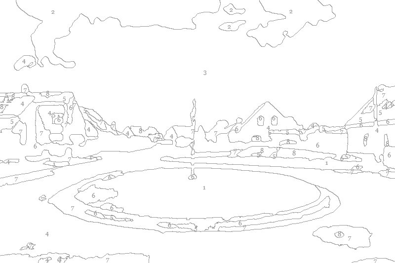



In 2023 dacht ik een rivier te volgen. Ik besloot de loop van de Durme te volgen, de rivier uit mijn kindertijd. Ik deed wat opzoekingen. Ik kwam tot de conclusie dat de Durme niet bestaat. Alleen maar op kaarten en in onze gedachten bestaat. Dat een rivier geen natuurverschijnsel is, maar een door de mens veranderd object, versnipperd. Hier en daar een plas, een beek, een getijdegeul (vreselijk woord, doet denken aan een wonde.)

Ik heb zes maanden foto's genomen. Maar uiteindelijk geen foto's gebruikt. Pas nu is me duidelijk wat ik in beeld wilde brengen. Die versnipperdheid.

Uiteindelijk heb ik de 2000 foto's teruggefilterd tot 5 beelden.

---split---

